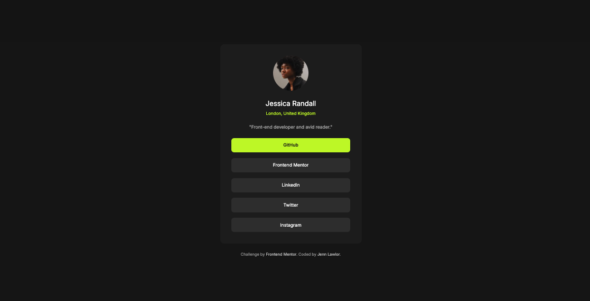
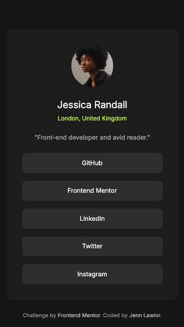

# Frontend Mentor - Social Links Profile Card Solution

This is my solution to the [Social Links Profile Card Challenge](https://www.frontendmentor.io/challenges/social-links-profile-card-component-8YEmA6ZsQ) on Frontend Mentor.  
Frontend Mentor challenges help you improve your coding skills by building realistic, production-ready components.

---

## Overview

### The Challenge

Users should be able to:

- View a **profile card** with the user's avatar, name, location, role, and social links.
- Click on **social links** that open in a new tab.
- Experience a **responsive layout** that looks good on mobile and desktop.
- See **hover/focus states** on the social links.

### Screenshots

**Desktop**

**Mobile**

### Live Demo

[View Live Demo](https://jenn-lawlor.github.io/social-links-profile)

---

## My Process

### Built With

- Semantic **HTML5 markup** (`<article>`, `<address>`, `<ul>`, `<li>`)
- **CSS custom properties** for theme colors and typography
- **Grid** for centering
- **Flexbox** for layout
- **Clamp()** for responsive card width
- Mobile-first workflow

## Author

👤 **Jenn Lawlor**  
Frontend Mentor - [@jenn-lawlor](https://www.frontendmentor.io/profile/jenn-lawlor)  
GitHub - [jenn-lawlor](https://github.com/jenn-lawlor)

---

✨ Thanks for checking out my solution! Feedback and suggestions are always welcome.